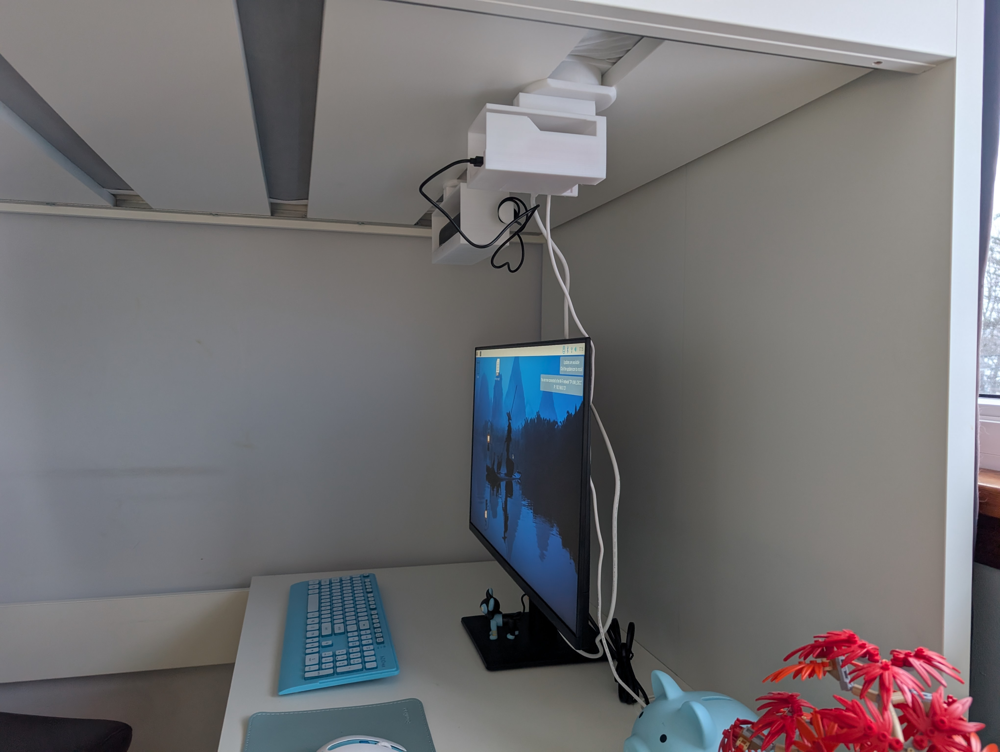
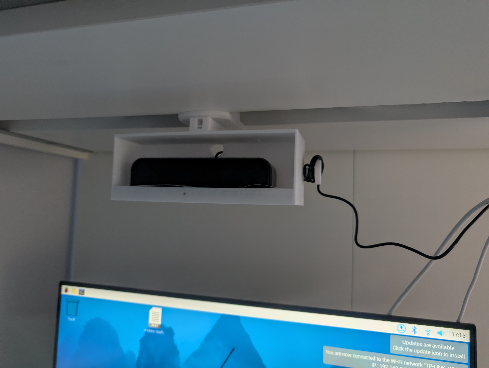
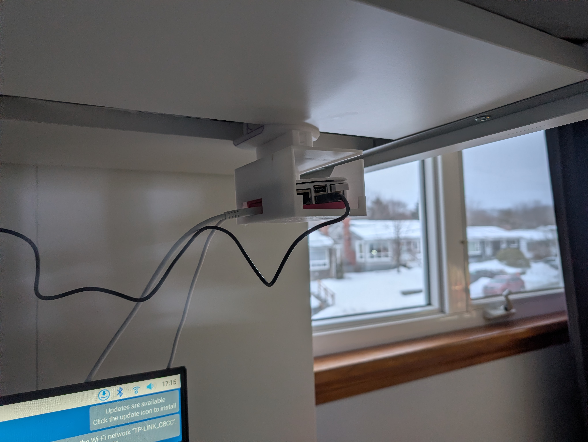
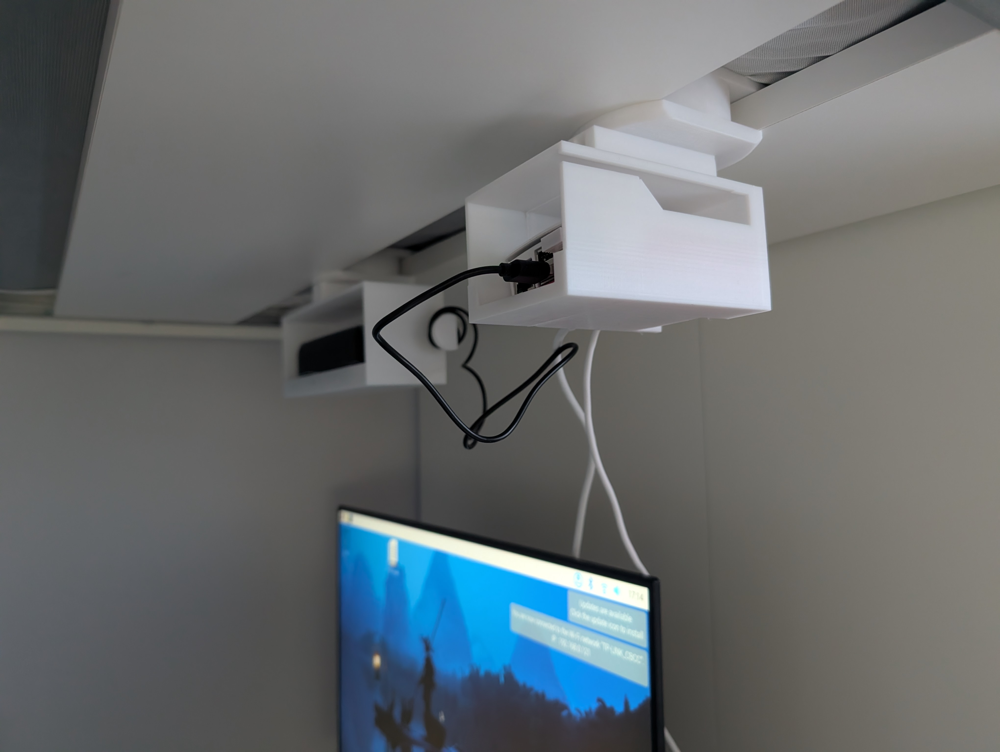
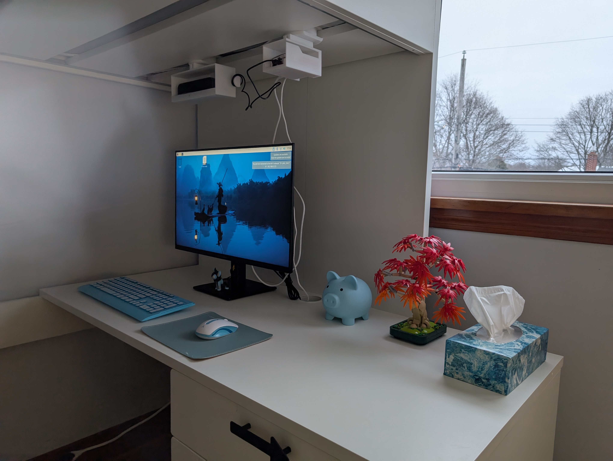

This is a file of my images of the bed hanger and pi box

the pi box and bed hanger are disinged to hang  
from the bottom boards  
on the bottom of a bunk/loft bed  
so far there is only a bed hanger and pi box  
you can dising your own and use the same hanger as me.

# the side

# this is the speaker

# this is the pi box

# random angle

# front

